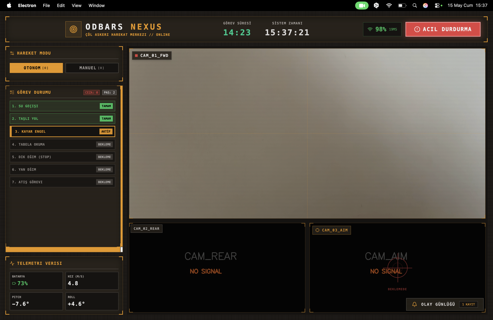
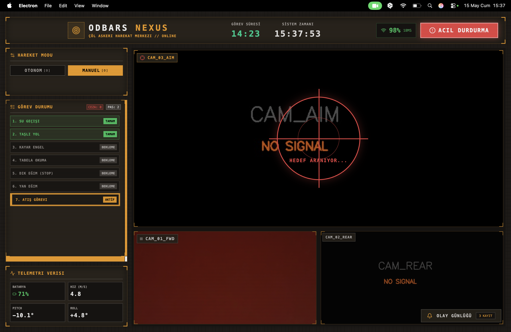
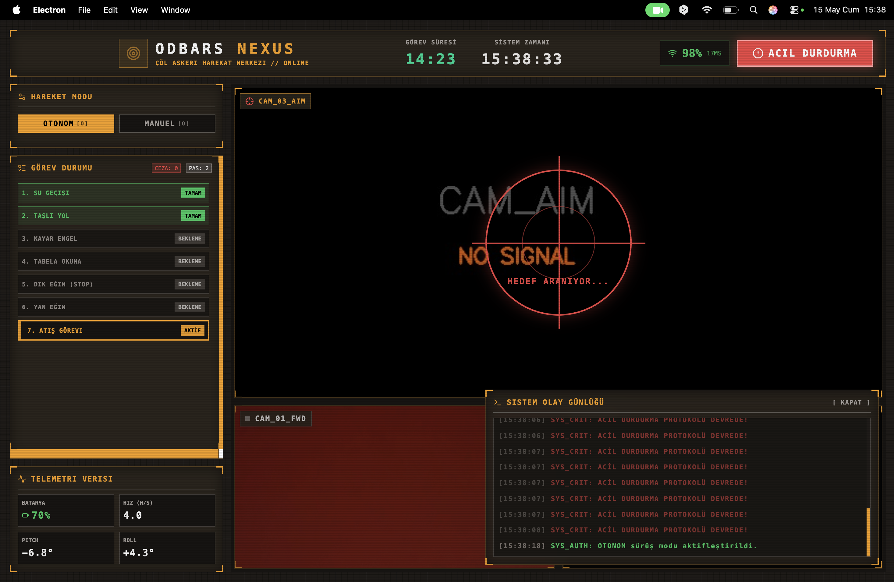
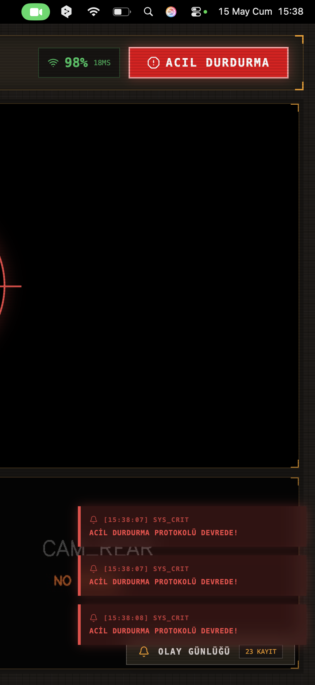

# 🚗 ODBARS — TEKNOFEST 2026 İnsansız Kara Aracı Yer Kontrol Sistemi

ODBARS (Otonom Düşman Bulma ve Analiz Robotik Sistemi) is the software suite developed for the TEKNOFEST 2026 Unmanned Ground Vehicle (UGV) competition. It consists of a React/Electron-based Ground Control Station (GCS) panel and a Python-based autonomous agent.

## 📸 Screenshots

<table>
  <tr>
    <td></td>
    <td></td>
  </tr>
  <tr>
    <td></td>
    <td align="center"></td>
  </tr>
</table>

## 🏆 Competition

- **Event:** TEKNOFEST 2026 — İnsansız Kara Araçları Yarışması (UGV)
- **Category:** Autonomous target detection and analysis
- **Language:** Turkish (Türkçe)

## 🧩 Project Structure

```
Odbars_Yazilim/
├── panel/          ← React + Vite + Electron GCS interface
├── agent/          ← Python autonomous decision agent
└── docs/           ← Architecture plans and system documentation
```

## ✨ Features

### GCS Panel (`panel/`)
- **Real-time telemetry display** — Battery, activity, signal status
- **Camera feed integration** — Live video from UGV
- **Mission control UI** — Built with React + Lucide icons
- **Desktop app** — Packaged with Electron for offline field use

### Autonomous Agent (`agent/`)
- Target detection and classification logic
- Mission state machine

## 🛠 Tech Stack

| Component | Technology |
|---|---|
| GCS UI | React 18 · Vite · Lucide Icons |
| Desktop | Electron |
| Agent | Python 3 |
| Styling | CSS (custom) |

## 🚀 Getting Started

### GCS Panel

```bash
cd panel
npm install
npm run dev        # Development server
npm run electron   # Launch as desktop app
```

### Agent

```bash
cd agent
# See INSTRUCTIONS.md for environment setup and run commands
```

## 📐 Architecture

See [`docs/system/architecture.md`](docs/system/architecture.md) for full system design.

## 👨‍💻 Developer

Created and developed by **[Serhan Ensar](https://github.com/SerhanEnsar)**.

## 📄 License

MIT
